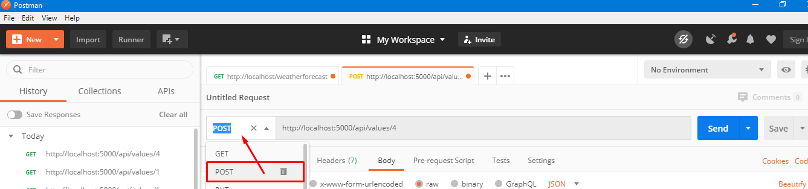
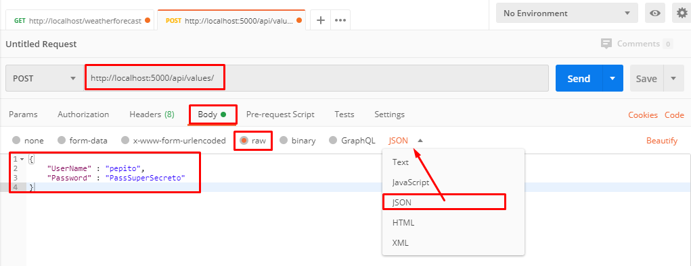

dotnet new global.json
> dotnet new global.json --sdk-version 2.2.207

dotnet new webapi -n api

dotnet restore

dotnet build 

dotnet run 


## Postman
> Recordar deshabilidad SSL en `File -> Settings -> SSL Certificate Verification`

* Consultar [http://localhost:5000/api/values](http://localhost:5000/api/values)

## Proyecto api


## Conceptos HTTP


### HTTP GET
Dentro del controlador `ValuesController.cs` creado de base por el FrameWork NetCore se identifican dos métodos definidos para responder a peticiones Get

#### Obtener lista de registros (todos)
```csharp
// Responde a las solicitudes GET sobre la ruta (http://localhost)/api/values
[HttpGet]
public ActionResult<IEnumerable<string>> Get()
{
    return new string[] { "value1", "value2" };
}
```

#### Obtener un registro  (id individual)
```csharp
// Responde a las solicitudes GET sobre la ruta (http://localhost)/api/values/5
[HttpGet("{id}")]
public ActionResult<string> Get(int id)
{
    return String.Format("value {0}", id);
}
```


### HTTP POST ()
Para poder comprender lo que sucede, haremos el envio de un valor sobre el body en el mensaje de petición http desde postman, que responde a un formato **JSON**
```Json
"[{'Username':'pepito', 'Password':'PassSuperSecreto'}]"
```
* Primero se indica que será una petición de tipo **POST**
    > 
* Ajuste la url de la petición a [http://localhost/api/values](http://localhost/api/values)
* Luego se define que el cuerpo de la solicitud (**body**), tiene un formato crudo (**raw**) y que corresponde a formato **JSON**, y se suministran los datos que indicamos anteriormente:
    > 
* Podría hacer **Send** 
  > **Pero antes modifiquemos el metodo POST en el proyecto api!!!!**

* Dentro del controlador `ValuesController.cs``, busque el método POST y ajustelo para que quede como se indica a continuación:
    ```csharp
    // Hacer una solicitud POST a la ruta (http://localhost)/api/values
    [HttpPost]
    public void Post([FromBody] string value)
    {
        return String.Format("Esta haciendo HTTP POST con el siguiente valor en el Boby del mensaje: {0}", value);
    }
    ```
* Guarde los cambios, construya y ejecute el proyecto `dotnet build && dotnet run`
* Haga la petición POST con postman y concluya.
    > * Que sucede si emplea el siguiente contenido como body en **Postman**
    ```Json
    {
        'Username':'pepito', 
        'Password':'PassSuperSecreto'
    }
    ```
    > Normalmente emitirá un error 400 de Bad Request, pues este es tan solo un ejemplo didactico que no hace operaciones de persistencia. 

### HTTP PUT ()
Para poder comprender lo que sucede, haremos el envio de valores sobre el cuerpo de la petición http (**body**), desde la herrramienta postman empleando la siguiente estructura en formato **JSON**
```Json
"[{'Username' : 'pepito', 'Password' : 'PassSuperSecreto'}]"
```
* Primero se indica que será una petición de tipo **PUT**
    > 
* Ajuste la url de la petición a [http://localhost/api/values/1](http://localhost/api/values/1)
* Luego se define que el cuerpo de la solicitud (**body**), tiene un formato crudo (**raw**) y que corresponde a formato **JSON**, y se suministran los datos que indicamos anteriormente:
    > 
* Podría hacer **Send** 
  > **Pero antes modifiquemos el método PUT en el proyecto api!!!!**

* Dentro del controlador `ValuesController.cs``, busque el método PUT y ajustelo para que quede como se indica a continuación:
    ```csharp
    // Hacer una solicitud POST a la ruta (http://localhost)/api/values
    [HttpPost]
    public string Post([FromBody] string value)
    {
        return String.Format("Esta haciendo HTTP POST con el siguiente valor en el Boby del mensaje: {0}", value);
    }
    ```
* Guarde los cambios, construya y ejecute el proyecto `dotnet build && dotnet run`
* Haga la petición PUT con postman y concluya.
    > Verifique que sucede al cambiar la url por 
    > * [http://localhost/api/values/2](http://localhost/api/values/2)
    > * [http://localhost/api/values/30](http://localhost/api/values/30)
    > * [http://localhost/api/values](http://localhost/api/values)

### HTTP Delete
Por lo pronto los ejemplos anteriores han sido dummy, así que omitiremos este apartado para abordar un ejemplos más real.


# Referencias utiles
* https://dotnettutorials.net/lesson/how-to-use-postman-to-test-web-api/
* https://www.c-sharpcorner.com/article/how-to-use-postman-with-asp-net-core-web-api-testing/
* http://dominiotic.com/serie-desarrolla-tu-primer-api-rest-en-asp-net-coreparte-final/


